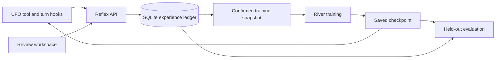

# Reflex

**Turn engineering work into intelligence you own.**

UFO supplies observable PR-review experience. Reflex keeps the review, human correction, and dataset lineage. River learns a focused reviewer through LoRA training. The same UFO tool can then call its saved checkpoint.

This repository implements the workflow with real provider adapters. It never substitutes a fabricated review, training run, checkpoint, or accuracy score when credentials are unavailable.

## Run locally

Requirements: Python 3.13 or newer, `uv`, and a current Node.js/npm installation. The verified development environment uses Python 3.14 and Node.js 26. All application data stays under this directory unless you change its configuration.

```sh
cp .env.example .env
# Edit .env to set your RIVER_API_KEY. Do not commit credentials.
sh scripts/dev.sh
```

Open **http://127.0.0.1:5173**. The API listens on `127.0.0.1:8000`. The app can inspect sample patches, collect explicitly confirmed human labels, and export training data before River is connected. Inference and training require River access and consume account credits.

To start the services separately:

```sh
UV_CACHE_DIR="$PWD/.uv-cache" uv sync
uv run uvicorn reflex.app:app --app-dir backend --host 127.0.0.1 --port 8000
```

In another terminal:

```sh
cd frontend
npm ci
npm run dev
```

Use one API worker. Jobs run in its process and persist progress in SQLite. On restart, unfinished jobs become interrupted; Reflex does not automatically repeat billable operations. A provider timeout does not establish whether remote computation stopped. Inspect the River Console before retrying an interrupted training run.

## Complete the loop

1. **Review.** Paste a patch and repository context, or inspect a clearly labeled fictional sample. Choose base, memory, or a completed learned checkpoint. The review records only observed actions and final output.
2. **Correct.** Confirm the decision, explain it, and select the relevant issue tags. Only explicitly confirmed training feedback qualifies for export or learning. You can also label a patch directly; it will not claim an AI reviewed it.
3. **Learn.** Train from the frozen set of confirmed examples. Start with at least ten varied examples including approvals. Choose SFT or SFT followed by bounded reward learning on that same model. RL scores sampled reviews against confirmed training labels; it skips the update when rewards do not vary. A training job records actual steps/losses and only adds a checkpoint after River confirms it was saved.
4. **Replay.** Run the held-out suite against base, memory, and learned conditions. Memory and learned receive identical prompts, frozen feedback, and generation settings. The UI shows actual counts, including invalid answers. Failed runs preserve their partial evidence.
5. **Use it in UFO.** Install the [verified self-hosted extension](docs/ufo.md), then call `review_code_with_reflex` with `condition="learned"`. It returns the specialist judgment and captures observable UFO turn events against the same experience.

The supplied curriculum contains fictional engineering PRs. Its proposed labels are in [sample-labeling.md](docs/sample-labeling.md); they are not silently inserted as human corrections. The held-out set is a small synthetic benchmark. It can test the mechanism but cannot establish generalization to your real repository or guarantee improvement.

## What is persisted

`data/reflex.sqlite3` stores experiences, corrections, job events, checkpoint identifiers, immutable training snapshots, and evaluation artifacts. Each checkpoint's training data can be exported even after later feedback changes. Combined runs save a recoverable SFT checkpoint before attempting RL. Secrets remain server-side. Common credential patterns are redacted, but this is not complete PII or secret detection: inspect an export before sending sensitive repository data to River.

River receives the approved training examples and inference context. Learned checkpoints are hosted by River and refer to adapters requiring their original base model. A `river://` URI is not a local download or a perpetual storage guarantee. See [the source and API research](docs/research.md) for the verified lifecycle, pricing, and limits.

## Architecture



The frontend uses React, TypeScript, and Vite. The backend uses FastAPI and the pinned River Python client. UFO is a separately installable extension pinned to a verified upstream source revision. Local requests never run commands from a submitted patch. If UFO executes tests, its carrier and repository permissions determine the execution boundary.

## Verify

```sh
uv run pytest -q
uv run ruff check backend tests integrations/ufo
cd frontend
npm run build
```

Tests exercise the actual API and SQLite through the primary workflow; only provider I/O is replaced. Adapter tests verify payload shapes, failure behavior, and SDK boundaries. These checks do not prove a live River account can train or that a learned model improves. Current evidence and remaining live steps are recorded in [verification.md](docs/verification.md).

## Integration references

- [River adapter and configuration](docs/river.md)
- [UFO extension, activation, and source pin](docs/ufo.md)
- [Research decisions and experiment contract](docs/research.md)
- [Manual sample-labeling guide](docs/sample-labeling.md)
- [Download the actual adapter weights](docs/export.md)

The local app is intended for a single operator and binds to loopback. UFO can authenticate its calls with `REFLEX_INGEST_TOKEN`. Remote multi-user hosting needs an authenticated application boundary and durable job workers before it is exposed publicly.
