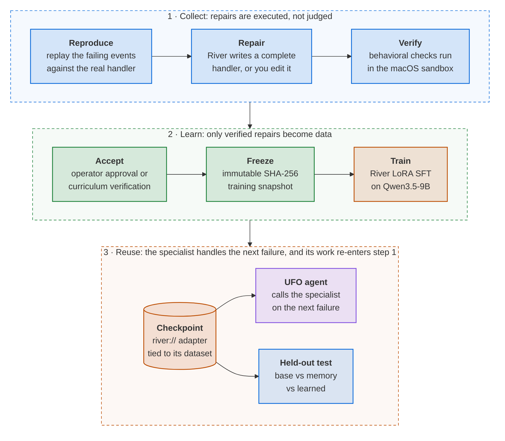
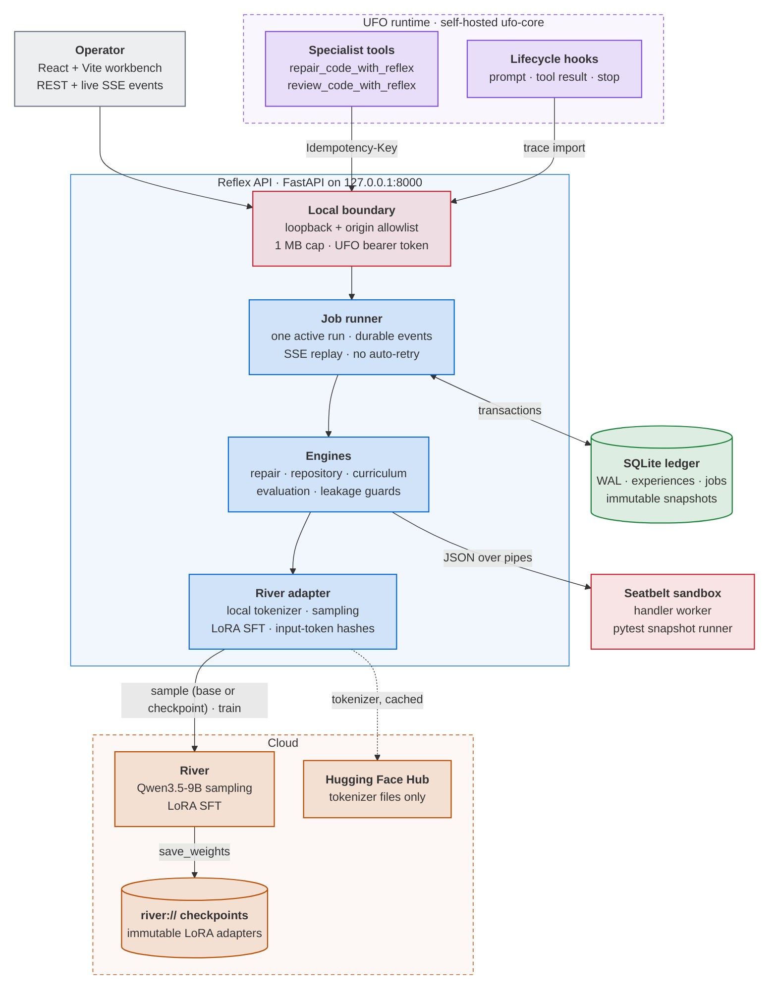
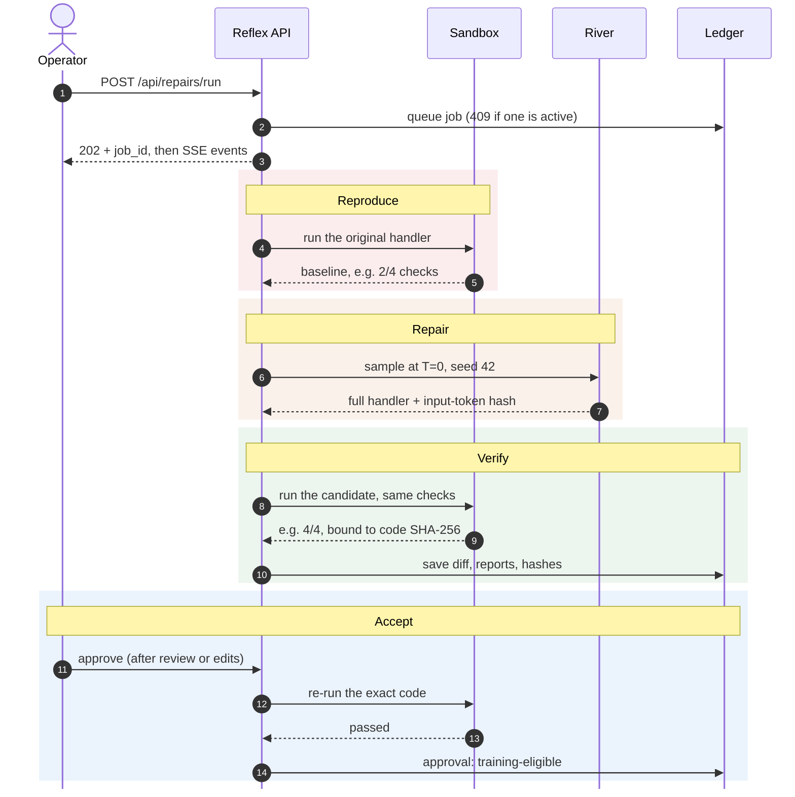
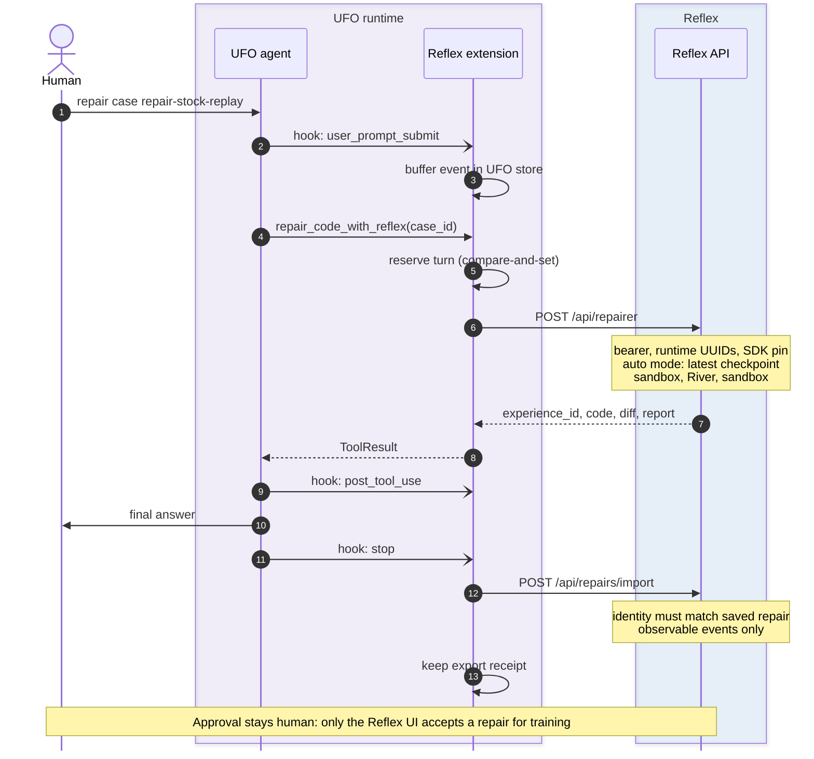
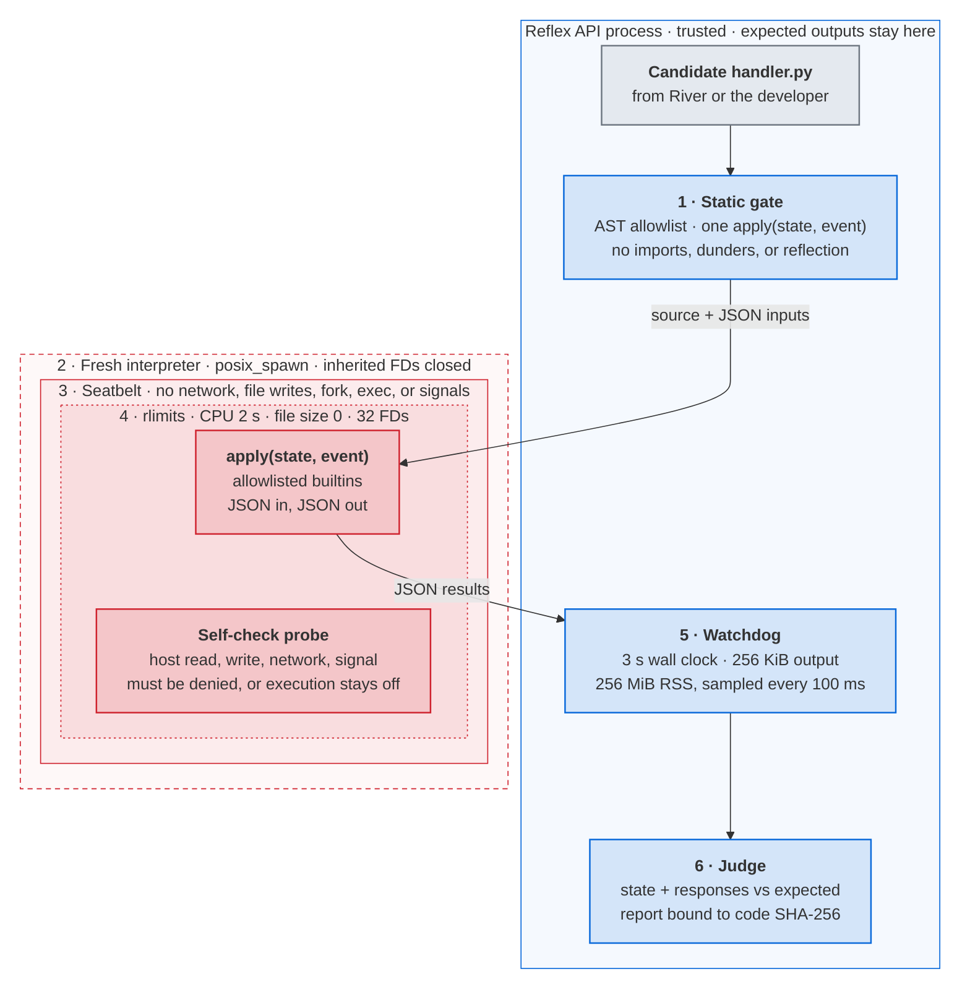
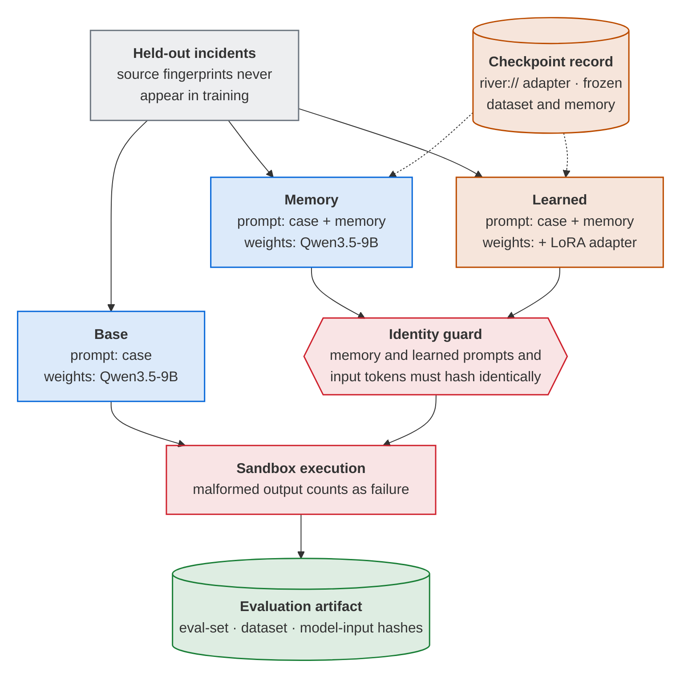
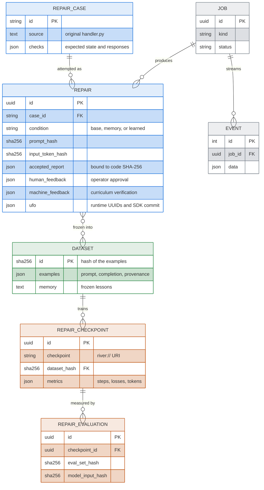
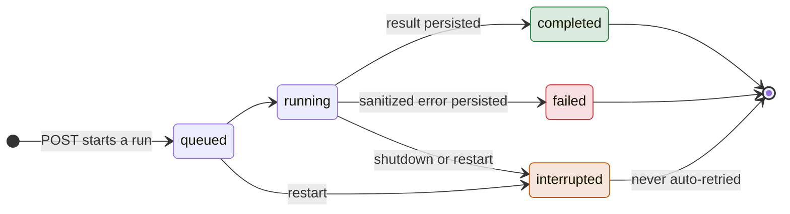

# Reflex

**Turn engineering work into intelligence you own.**

Reflex is a repair workspace for recurring engineering failures. Reproduce a broken customer flow, inspect a River-generated patch, execute behavioral checks, and turn accepted repairs into a specialist model. UFO supplies the agent runtime and observable work; Reflex retains the evidence and dataset lineage; River updates the model's weights.

**The live loop:** verified repairs became **24 training examples**. River saved **`reflex-repair-v4-48steps-20260927` after 48 weight updates and 122,752 processed training tokens**. The installed UFO SDK's real `repair_code_with_reflex` tool then used that checkpoint to repair the stock-replay training case: **2/4 → 4/4 executed checks in about 5.7 seconds**, with its observable trace saved. This was a programmatic SDK invocation; a full authenticated UFO conversation has not been demonstrated. [Training receipt](docs/evidence/reflex-v4-training.json) · [Live UFO receipt](docs/evidence/ufo-live-v4.json).

**Measured limits:** the earlier complete v3 held-out comparison remains **base 4/4 · memory 4/4 · learned 4/4**, with matching memory/learned prompts. No accuracy gain was measured. The later v4 replay had a base execution permission error; that infrastructure failure does not establish a learning advantage. The first checkout repair also remains recorded: **2/4 → 4/4 checks in 15.4 seconds**. [Full receipts and limits](docs/verification.md).

The local Repository tab also inspects Python source and executes its regression tests in an isolated snapshot; a real source/test pair returned **7 passed, 1 skipped**. The complete backend suite passed **240 tests and 88 subtests**, and global Ruff passed.

**[Watch the narrated demo](https://ankitshah009.github.io/Reflex_own_intelligence_hack/)** · [Submission fields](docs/submission.md) · [Live UFO receipt](docs/evidence/ufo-live-v4.json)

Source: [Reflex on GitHub](https://github.com/ankitshah009/Reflex_own_intelligence_hack).

For the presentation, use the [final narrated transcript](docs/demo-assets/narration.txt) and [submission fields](docs/submission.md).

The [recorded v3 evidence](docs/evidence/reflex-v3.json) contains the saved training and evaluation results in JSON.

This repository implements the workflow with real provider adapters. It never substitutes a fabricated review, training run, checkpoint, or accuracy score when credentials are unavailable.

## How it works



The gates between stages are enforced in code. A repair becomes training data only after its exact source passes executed checks. Training snapshots are immutable and addressed by SHA-256, and held-out handlers are rejected from training by AST fingerprint. [Architecture](#architecture) shows each part in detail.

## Who would use it

The initial buyer hypothesis is an engineering team maintaining checkout,
billing, inventory, or webhook integrations. Repeated incident fixes become a
team-specific repair specialist. The product would charge for a shared team
workspace plus metered training; pricing and customer demand are not validated.
The useful metric is fewer developer corrections per verified repair, measured
against the same base model with memory. A small synthetic benchmark is the
first experiment, not proof of production savings.

## Run locally

Requirements: Python 3.13 or newer, `uv`, and a current Node.js/npm installation. The verified development environment uses Python 3.14 and Node.js 26. All application data stays under this directory unless you change its configuration.

```sh
cp .env.example .env
# Edit .env to set your RIVER_API_KEY. Do not commit credentials.
sh scripts/dev.sh
```

Open **http://127.0.0.1:5173** for the repair workbench. The original PR-review workspace remains at **http://127.0.0.1:5173/#review**. The API listens on `127.0.0.1:8000`. Reproduction, source editing, behavioral checks, and exports run locally. Inference and training require River access and consume account credits. Executable repair checks currently require macOS with Seatbelt available.

To start the services separately:

```sh
UV_CACHE_DIR="$PWD/.uv-cache" uv sync
uv run uvicorn reflex.app:app --app-dir backend --host 127.0.0.1 --port 8000
```

In another terminal:

```sh
cd frontend
npm ci
npm run dev
```

Use one API worker. Jobs run in its process and persist progress in SQLite. On restart, unfinished jobs become interrupted; Reflex does not automatically repeat billable operations. A provider timeout does not establish whether remote computation stopped. Inspect the River Console before retrying an interrupted training run.

## Repair workflow

1. **Reproduce:** replay duplicate checkout, inventory, refund, or cancellation events and inspect the actual resulting state.
2. **Repair:** ask River for replacement handler code or edit it yourself. Run the same behavioral checks in a bounded local sandbox.
3. **Accept:** review a passing patch and explicitly approve it for training. Editing invalidates earlier verification; the server rechecks acceptance.
4. **Learn:** train SFT on an immutable snapshot of accepted repairs and machine-verified generated samples. Provenance distinguishes those two sources. A checkpoint appears only after River confirms it.
5. **Compare:** evaluate four excluded cases against base, memory, and learned weights. Memory and learned use identical input tokens.
6. **Reuse through UFO:** the installed SDK tool calls the saved specialist and imports its observable work into the experience ledger. The live v4 stock-repair receipt demonstrates this path.

You can bring a Python `apply(state, event)` handler with its initial state,
events, and expected outputs. The supplied six training incidents and four
held-out variants are clearly identified samples. The generated curriculum produced 19 verified repairs from 23 River requests across 24 attempted tasks. Those variants come from six templates. Together with five operator-accepted repairs, they supplied the 24-example v3 training set. See [repair scope and limits](docs/repair.md).

The **Repository** tab selects a local `backend/**/*.py` source file and a `tests/**/*.py` test file, reproduces the selected tests, and lets you inspect and verify a candidate patch. Tests run against a bounded snapshot; the original working files are preserved. The completed learning experiment above used event handlers, so it does not establish learned-model improvement on repository tasks.

## PR-review workflow

1. **Review.** Paste a patch and repository context, or inspect a clearly labeled fictional sample. Choose base, memory, or a completed learned checkpoint. The review records only observed actions and final output.
2. **Correct.** Confirm the decision, explain it, and select the relevant issue tags. Only explicitly confirmed training feedback qualifies for export or learning. You can also label a patch directly; it will not claim an AI reviewed it.
3. **Learn.** Train from the frozen set of confirmed examples. Start with at least ten varied examples including approvals. Choose SFT or SFT followed by bounded reward learning on that same model. RL scores sampled reviews against confirmed training labels; it skips the update when rewards do not vary. A training job records actual steps/losses and only adds a checkpoint after River confirms it was saved.
4. **Replay.** Run the held-out suite against base, memory, and learned conditions. Memory and learned receive identical prompts, frozen feedback, and generation settings. The UI shows actual counts, including invalid answers. Failed runs preserve their partial evidence.
5. **Use it in UFO.** Install the [verified self-hosted extension](docs/ufo.md), then call `review_code_with_reflex` with `condition="learned"`. It returns the specialist judgment and captures observable UFO turn events against the same experience.

The supplied curriculum contains fictional engineering PRs. Its proposed labels are in [sample-labeling.md](docs/sample-labeling.md); they are not silently inserted as human corrections. The held-out set is a small synthetic benchmark. It can test the mechanism but cannot establish generalization to your real repository or guarantee improvement.

## What is persisted

`data/reflex.sqlite3` stores experiences, corrections, job events, checkpoint identifiers, immutable training snapshots, and evaluation artifacts. Each checkpoint's training data can be exported even after later feedback changes. Combined runs save a recoverable SFT checkpoint before attempting RL. Secrets remain server-side. Common credential patterns are redacted, but this is not complete PII or secret detection: inspect an export before sending sensitive repository data to River.

River receives the approved training examples and inference context. Learned checkpoints are hosted by River and refer to adapters requiring their original base model. A `river://` URI is not a local download or a perpetual storage guarantee. See [the source and API research](docs/research.md) for the verified lifecycle, pricing, and limits.

## Architecture

Color key: blue is Reflex, purple is UFO, orange is River, green is verified data, red is an isolation or safety boundary, and gray is a person or input.

### System overview



The frontend uses React, TypeScript, and Vite. The backend uses FastAPI and the pinned River Python client. UFO is a separately installable extension pinned to a verified upstream source revision. Review requests do not execute patches. Repair requests execute restricted Python handlers in a mandatory macOS sandbox with CPU, wall-time, output, and memory observation limits; expected results stay in the parent process. If UFO independently executes repository commands, its carrier determines that execution boundary.

### Anatomy of a repair run



Every step is appended to the job's durable event log and streamed over SSE. Each execution report carries the SHA-256 of the exact code that ran, so an edited patch loses its verification, and acceptance re-executes the approved code on the server.

### How UFO calls the specialist



Each UFO turn gets one specialist request, reserved with compare-and-set before any HTTP call. A stable `ufo-repair:<workspace>:<turn>` idempotency key means a retry returns the saved result instead of triggering a second model call. Only observable events are imported, never model reasoning or approval labels.

### Execution sandbox



Candidate code runs in a separate interpreter under macOS Seatbelt, and the expected outputs never enter it. If the self-check probe cannot prove isolation, execution stays disabled; there is no unsandboxed fallback. Repository tests run under the same kind of boundary: a read-only snapshot, a disposable scratch directory, 45 seconds, and 512 MiB.

### Controlled comparison



Memory and learned receive token-identical inputs, so any difference between them comes from the weights. The recorded v3 run scored base 4/4, memory 4/4, and learned 4/4. The benchmark saturated, so no gain is claimed.

### Data lineage



Every checkpoint points to the SHA-256 of the exact examples it was trained on, and dataset snapshots cannot be modified or deleted. The PR-review path mirrors this with experiences, checkpoints, and evaluations.

### Job lifecycle



One run at a time. A restart marks unfinished jobs as interrupted and never resubmits billable River work.

## Verify

```sh
uv run pytest -q
uv run ruff check backend tests integrations/ufo
cd frontend
npm run build
```

Tests exercise the actual API and SQLite through the primary workflow; only provider I/O is replaced. Adapter tests verify payload shapes, failure behavior, and SDK boundaries. These checks do not prove a live River account can train or that a learned model improves. Current evidence and remaining live steps are recorded in [verification.md](docs/verification.md).

## Integration references

- [River adapter and configuration](docs/river.md)
- [UFO extension, activation, and source pin](docs/ufo.md)
- [Research decisions and experiment contract](docs/research.md)
- [Manual sample-labeling guide](docs/sample-labeling.md)
- [Download the actual adapter weights](docs/export.md)

The local app is intended for a single operator and binds to loopback. UFO can authenticate its calls with `REFLEX_INGEST_TOKEN`. Remote multi-user hosting needs an authenticated application boundary and durable job workers before it is exposed publicly.
